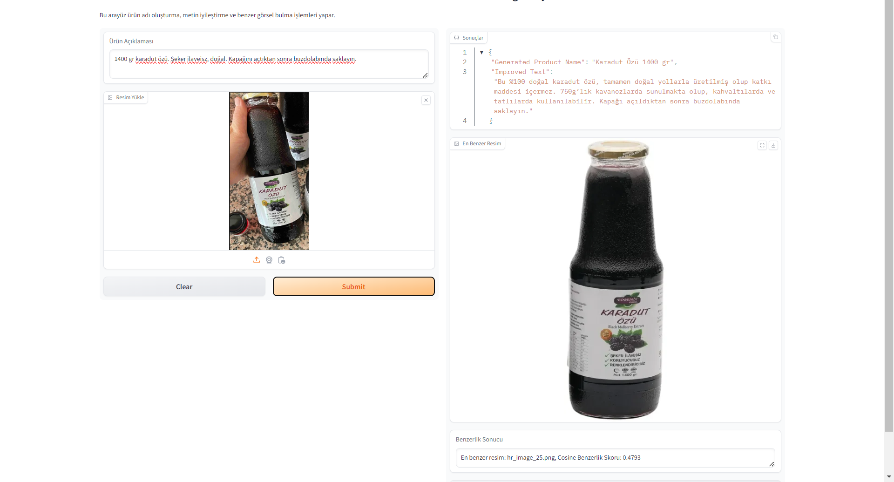
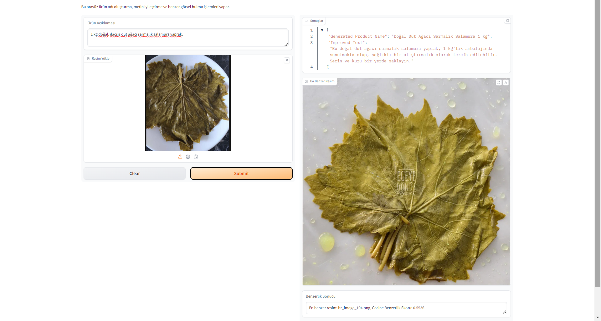

# Trendyol Teknofest E-Commerce Hackathon Project - Product Name Generation Model, Text Improvement Model & Image Similarity Detection Algorithm

This repository is part of an e-commerce solution aimed at enhancing the digital presence of local producers by generating product names, improving product descriptions, and finding visually similar high-resolution images. The project includes three main components: product name generation, text improvement, and image similarity detection.

## Project Structure

The repository is divided into four key modules:

1. **Find Product Name Model**  
   Fine-tunes a pre-trained MT5 model to generate product names based on short product descriptions.
2. **Text Improvement Model**  
   Fine-tunes another MT5 model to improve and enrich product descriptions in Turkish.

3. **Image Similarity Detection**  
   Uses the VGG16 model to compare the similarity between a user-provided image and a collection of high-resolution images.

4. **Inference Pipeline**  
   Integrates the above models into a Gradio interface to provide a complete solution for product name generation, description improvement, and image similarity comparison.

---

## Project Inference Samples





## Installation

### Dependencies

All the necessary libraries are listed in the `requirements.txt` files located in each folder. To install the required libraries, run the following command:

```bash
pip install -r requirements.txt
```

For CUDA-supported versions (for faster training and inference):

```bash
pip install torch torchvision torchaudio --index-url https://download.pytorch.org/whl/cu124
```

---

## Modules Overview

### 1. Find Product Name Model

This model fine-tunes the MT5 model to generate product names from product descriptions. It uses a custom dataset of input-output pairs where each input represents a description, and the output is a suitable product name.

**Files and Their Functions**:

| File Name                                  | Description                                                                            |
| ------------------------------------------ | -------------------------------------------------------------------------------------- |
| `evaluation_find_product_name_model.ipynb` | Jupyter notebook for evaluating the model using ROUGE metrics.                         |
| `find_product_name_model_generator.py`     | Script for fine-tuning and saving the MT5 model. Includes a sample inference function. |
| `findProdName-io.json`                     | Custom dataset with input-output pairs for product name generation.                    |
| `requirements.txt`                         | Required dependencies for this module.                                                 |

**Usage**:

- To train the model, run:

  ```bash
  python find_product_name_model_generator.py
  ```

- To evaluate the model using ROUGE metrics, open and run:

  ```bash
  jupyter notebook evaluation_find_product_name_model.ipynb
  ```

---

### 2. Text Improvement Model

This model improves product descriptions by enhancing natural language content using a fine-tuned MT5 model. It focuses on making product descriptions more appealing and informative.

**Files and Their Functions**:

| File Name                                 | Description                                                               |
| ----------------------------------------- | ------------------------------------------------------------------------- |
| `evaluation_text_improvement_model.ipynb` | Jupyter notebook for evaluating the fine-tuned model using ROUGE metrics. |
| `text_improvement_model_generator.py`     | Script for fine-tuning and saving the model.                              |
| `textImprove-io.json`                     | Dataset with input-output pairs used for training the model.              |
| `requirements.txt`                        | Required dependencies for this module.                                    |

**Usage**:

- To train the text improvement model, run:

  ```bash
  python text_improvement_model_generator.py
  ```

- To evaluate the model, open and run:

  ```bash
  jupyter notebook evaluation_text_improvement_model.ipynb
  ```

---

### 3. Image Similarity Detection

This project compares a user-provided image to a set of high-resolution images and finds the most similar one using the VGG16 model and cosine similarity.

**Files and Their Functions**:

| Function Name                   | Description                                                             |
| ------------------------------- | ----------------------------------------------------------------------- |
| `load_vgg_model()`              | Loads the pre-trained VGG16 model.                                      |
| `extract_features()`            | Extracts a 4096-dimensional feature vector from the image.              |
| `calculate_cosine_similarity()` | Computes the cosine similarity between two feature vectors.             |
| `find_most_similar_image()`     | Finds and displays the most similar image based on the feature vectors. |

**Usage**:

- Ensure you have installed the required libraries with:

  ```bash
  pip install numpy opencv-python tensorflow scikit-learn matplotlib
  ```

- Use the `find_most_similar_image()` function to compare images and find the closest match based on cosine similarity.

---

### 4. Inference Pipeline

This script integrates the product name generation model, text improvement model, and image similarity detection into a Gradio interface. The interface accepts product descriptions and images and returns a generated product name, improved description, and the most similar image.

**Files and Their Functions**:

| File Name          | Description                                                                   |
| ------------------ | ----------------------------------------------------------------------------- |
| `inference.py`     | Script to launch the Gradio interface, integrating all models and algorithms. |
| `requirements.txt` | Required dependencies for running the Gradio interface.                       |

**Usage**:

- Install the required dependencies by running:

  ```bash
  pip install -r requirements.txt
  ```

- To launch the Gradio interface, run:

  ```bash
  python inference.py
  ```

- The interface will allow you to input text and images and generate a product name, improve the text, and find the most visually similar image.

---

## Acknowledgements

- [Hugging Face Transformers](https://huggingface.co/docs/transformers/index): For providing the MT5 model and training utilities.
- [PyTorch](https://pytorch.org/): For the deep learning framework used in this project.
- [TensorFlow/Keras](https://www.tensorflow.org/): For the VGG16 model used in image similarity detection.
